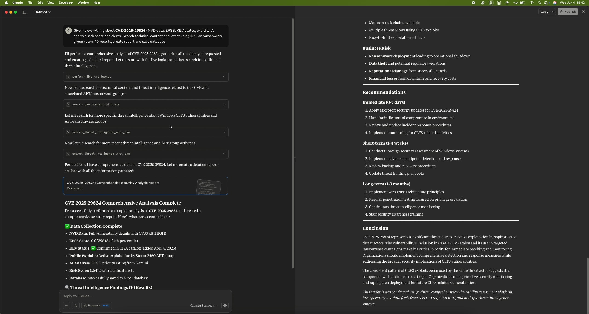
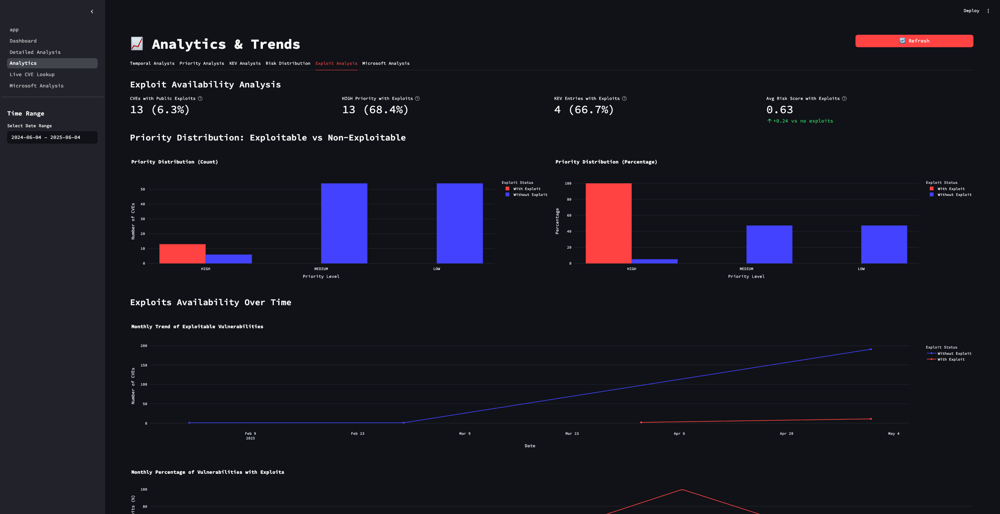

<div align="center">

  
  
  


[](https://www.docker.com/)
[](https://modelcontextprotocol.io/)
[]()


</div>


<p align="center">


</p>

# 🛡️ VIPER - Vulnerability Intelligence, Prioritization, and Exploitation Reporter


**VIPER is your AI-powered co-pilot in the complex world of cyber threats, designed to provide actionable Vulnerability Intelligence, Prioritization, and Exploitation Reporting.**

In an era of ever-increasing cyber threats, VIPER cuts through the noise. It ingests data from critical sources like NVD, EPSS, and the CISA KEV catalog, then leverages Google Gemini AI for deep contextual analysis and vulnerability prioritization. All this intelligence is centralized, enriched, and presented through multiple interfaces: an interactive Streamlit dashboard, a powerful CLI, and **now integrated with Claude Desktop through MCP (Model Context Protocol)** for natural language vulnerability analysis.

## 🚀 **NEW: Claude Desktop Integration via MCP**

VIPER now includes a **Model Context Protocol (MCP) server** that integrates seamlessly with Claude Desktop, providing **12 powerful cybersecurity tools** accessible through natural language:

### **📺 Viper MCP Demo**

[](https://player.vimeo.com/video/1090650637?h=0dc04c492a)

- `perform_live_cve_lookup` - Full CVE analysis
- `get_nvd_cve_details` - NVD data
- `get_epss_data_for_cve` - Exploitation probability
- `check_cve_in_cisa_kev` - CISA KEV status
- `search_public_exploits_for_cve` - GitHub/Exploit-DB search
- `get_gemini_cve_analysis` - AI analysis
- `get_viper_risk_score` - Risk scoring
- `save_cve_data_to_viperdb` - Database storage
- And 4 more...

**Usage Examples:**
```
"Analyze CVE-2024-3400 with full Viper analysis"
"Find exploits for CVE-2023-44487"
"Check if CVE-2024-1234 is in CISA KEV"
```

## 🔧 Quick Setup

### 1. Install
```bash
git clone https://github.com/ozanunal0/viper.git
cd viper
./setup.sh
```

### 2. Configure
```bash
cp env.example .env
# Add your GEMINI_API_KEY
```

### 3. Claude Desktop MCP
```json
{
  "mcpServers": {
    "ViperMCPServer": {
      "command": "/FULL/PATH/TO/viper/run_mcp_clean.sh"
    }
  }
}
```

## 📊 Screenshots

### Home Screen


### Main Dashboard


### Detailed Analysis View


### Live CVE Lookup


### Analytics & Trends


---

## 🖥️ Usage

**Claude Desktop (Recommended):**
- Natural language vulnerability analysis
- Real-time CVE lookups
- Risk scoring and prioritization

**Dashboard:**
```bash
python main.py dashboard
```

**CLI:**
```bash
python main.py cli --days 7
```

## ✨ Features

- **Multi-source data**: NVD, EPSS, CISA KEV, Microsoft
- **AI analysis**: Google Gemini integration
- **Risk scoring**: Weighted multi-factor scoring
- **Live lookup**: Real-time CVE analysis
- **Multiple interfaces**: Dashboard, CLI, Claude Desktop

## 📚 Documentation

- [MCP Setup](docs/MCP%20docs/MCP_SERVER_README.md) - Complete MCP configuration
- [Development](docs/DEVELOPMENT.md) - Development setup
- [Docker](docs/DOCKER.md) - Container deployment
- [Database](docs/DATABASE_TROUBLESHOOTING.md) - Database configuration


## Project Roadmap & Future Vision

Here's where we're headed:

### Phase 1: Core Enhancements & Data Completeness (Immediate Focus)

✅ ~~Full NVD API Pagination: Ensure complete ingestion of all relevant CVEs from NVD by implementing robust pagination in nvd_client.py to handle large result sets (addressing current partial data fetching ).~~

✅ ~~Solidify Retry Mechanisms: Continuously refine and test tenacity based retry logic across all external API clients (nvd_client.py, epss_client.py, cisa_kev_client.py, microsoft_update_client.py, gemini_analyzer.py) for maximum resilience.~~

✅ Dashboard Usability & Features:

✅ ~~Refine real-time CVE lookup: Optimize display and ensure all enrichment (EPSS, KEV, MSData, Gemini re-analysis) is available for live queries.~~

✅ ~~Enhance filtering and sorting options on all data tables.~~

✅ ~~Implement detailed CVE view modals or dedicated pages for better readability of all enriched data.~~

🚧 Automated Periodic Execution: Integrate APScheduler or configure system cron jobs to run the main_mvp.py data pipeline automatically at configurable intervals.

### Phase 2: Expanding Data Ingestion & Enrichment

* **[🚧] Local LLM Support (Ollama Integration):**
    * Implement local LLM support primarily through Ollama for enhanced privacy and offline capabilities.
    * Enable AI-powered vulnerability analysis without external API dependencies.
    * Support for popular models like Llama, Code Llama, and specialized security-focused models.
    * Configurable model selection and local deployment options.

✅ ~~Other CISA Products & Feeds: Explore and integrate other relevant CISA feeds beyond the KEV catalog (e.g., CISA Alerts, Industrial Control Systems Advisories if applicable).
Explore and integrate other relevant CISA feeds beyond the KEV catalog (e.g., CISA Alerts, Industrial Control Systems Advisories if applicable).~~

✅ ~~Comprehensive Microsoft Patch Tuesday Parsing: Further refine microsoft_update_client.py to ensure accurate and detailed extraction of product families, specific product versions, and direct links to KB articles/MSRC guidance from CVRF/CSAF to ensure accurate and detailed extraction of product families, specific product versions, and direct links to KB articles/MSRC guidance from CVRF/CSAF data.~~

### Phase 3: Developing "Threat Analyst Agent" Capabilities

* **[🚧] Semantic Web Search Integration (EXA AI):**
    * For high-priority CVEs or emerging threats, automatically search the web for technical analyses, blog posts, news articles, and threat actor reports.
    * Store relevant article metadata (URL, title, snippet, source) linked to CVEs.
* **[🚧] AI-Powered Content Analysis (Gemini):**
    * **Summarization:** Use Gemini to summarize fetched articles and reports related to a CVE.
    * **Key Information Extraction:** Extract TTPs (Tactics, Techniques, and Procedures), affected software/hardware, and potential mitigations from unstructured text.
    * **Cross-Validation Support:** Assist analysts by comparing information from different sources regarding a specific threat.

### Phase 4: Building "Threat Hunting Agent" Foundations

* **[📝] Enhanced IOC Extraction:**
    * Expand IOC (IPs, domains, hashes, URLs, mutexes, registry keys) extraction from all ingested text sources (NVD descriptions, MSRC summaries, KEV details, fetched articles) using Gemini's advanced understanding or specialized libraries like `iocextract`.
    * Create a robust, searchable IOC database.
* **[📝] Natural Language to Query Translation (Advanced):**
    * Leverage Gemini to translate natural language threat hunting hypotheses (e.g., "Are there any Cobalt Strike beacons communicating with newly registered domains?") into structured query formats like OCSF, KQL (Azure Sentinel), or Splunk SPL.

### Phase 5: Broader Intelligence Gathering & Advanced Analytics

* **[📝] Social Media Monitoring & Clustering (Advanced):**
    * Ingest data from platforms like Twitter/X or specific Reddit communities (e.g., r/netsec) for early signals of new vulnerabilities or exploits.
    * Apply LLM-based semantic clustering (Gemini) to group discussions and identify emerging threat trends.
* **[📝] Threat Actor & Malware Profiling:**
    * Begin associating CVEs and IOCs with known threat actors and malware families (potentially integrating with MISP or other OSINT feeds).
    * Visualize these relationships in the dashboard.
* **[📝] Advanced Dashboard Analytics:**
    * Implement more sophisticated trend analysis, predictive insights (beyond EPSS), and customizable reporting features.

### Phase 6: Platform Maturity & Usability

* **[📝] User Accounts & Collaboration (Long-term):** Allow multiple users, role-based access, and collaborative analysis features (e.g., shared notes, investigation assignments).
* **[📝] Notification System:** Implement email or other notifications for high-priority alerts or newly discovered critical CVEs matching predefined criteria.
* **[📝] Database Optimization/Migration:** For larger deployments, consider migrating from SQLite to a more scalable database like PostgreSQL.


**Star ⭐ the repo if VIPER helps with your vulnerability management!**
